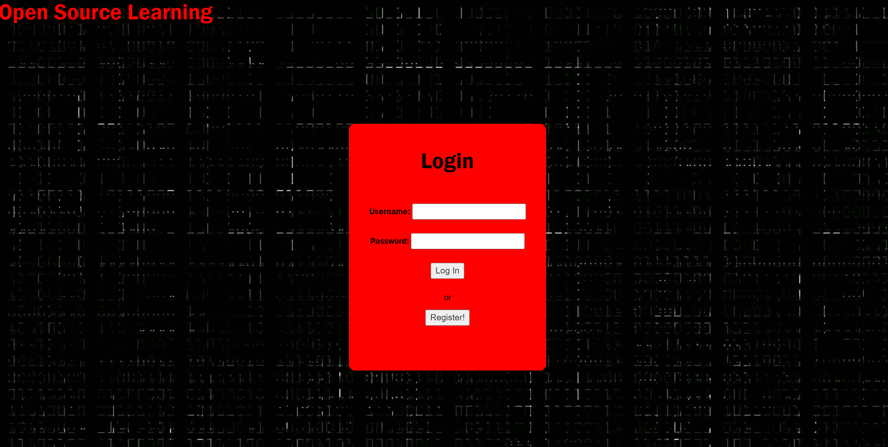
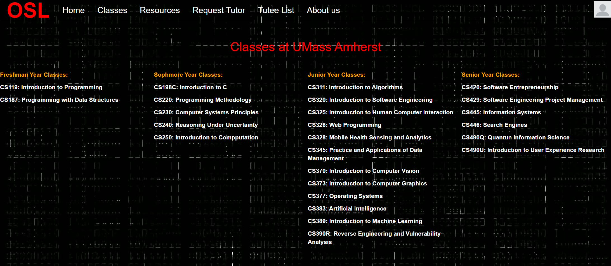
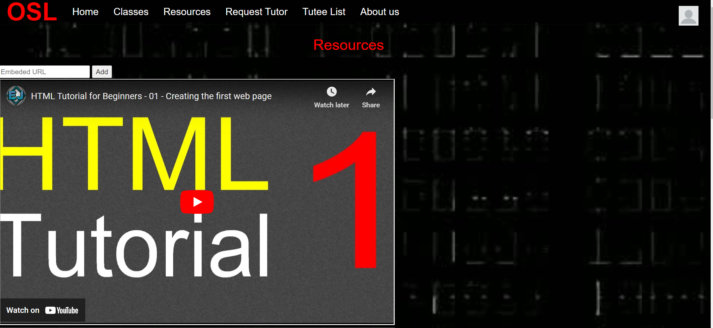
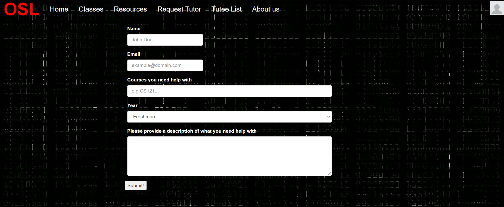
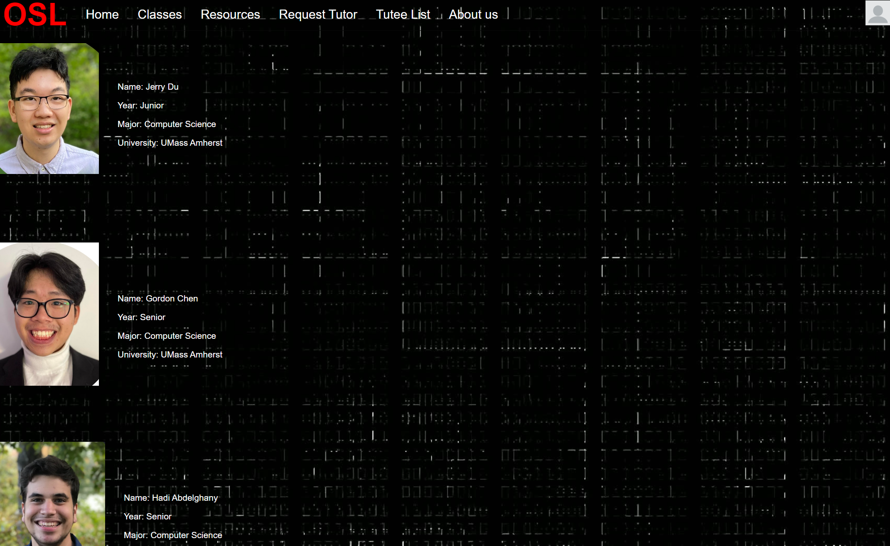
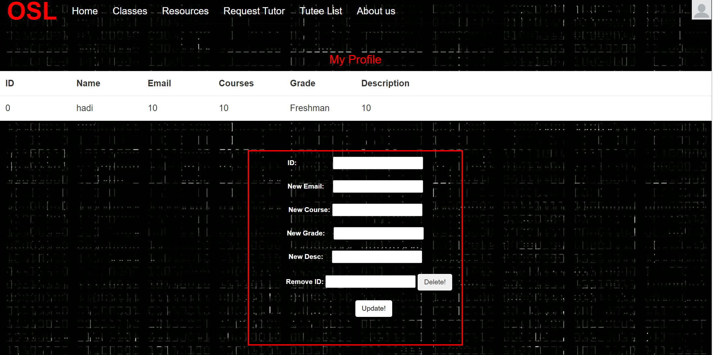

Title: Team rho

Subtitle: Open Source Learning

Semester: Fall 2022

Overview:
     Our application allows an end user to get tutoring for any Computer Science class at UMass Amherst. It additionally allows the user to watch and add videos on important coding and studying techniques which in turn provides a great studying enviornment. Our application is innovative due to the fact that there isn't a dedicated website for people to get tutoring for specifically computer science classes. In addition, the resources page is something that isn't common on tutoring pages

Team Members: 
    Jerry Du: jldu20
    Gordon Chen: gchen151
    Hadi Abdelghany: abdeha2023

User Interface:
    The user is greeted with the login page. Once the user logins in or creates an account the Open Source Learning home page will appear. The nav bar at the top allows the user to navigate the website with ease. The classes page gives the user a list of the possible CS classes they can take as well as request a tutor for. The next tab, resources is a place where the user can watch videos posted by other students as well as post a video themselves that they may have found helpful. The next tab Request Tutor is the heart of the application. This allows the user to create a request for a tutor that will in turn appear on the tutee list, which happens to be the next tab. Once the user hits the submit button in the request tutor page, their request will appear here where a tutor can see it and decide to help the user out! Finally the about us page is just a page that lets the user know who createad the website they are using! Aside from the nav bar, there is a drop-down menu that has multiple other pages. The update profile page allows the user to make changes to any one of their tutoring requests. The create profile simply brings you to the request tutor page where you can create your profile. And last but not least the Log out button which simply logs you out of the website.

LOGIN PAGE: 

CLASSES PAGE:

RESOURCES PAGE:

REQUEST TUTOR PAGE:

ABOUT US PAGE:

DROPDOWN MENU:

UPDATE PROFILE PAGE:

Database:
    Our application uses the mongo database. Using Mongo db we created 3 collections. login_info, tutees, and videos. The first collection, login_info, is the place where we store all the exisiting and new username and passwords of the users. The second collection, tutees, is the place where we store all of the tutoring requests that the user submits. The final collection, videos, is the place where we store all of the videos that the users submit to the resouces page. 

API/URL Routes/Mappings
    Get: /getTutee
    Retrieves the entire tutee database to display on front end
    Delete: /deleteTutee
    Input: {Name: “”, Email: “”, Grade: “”, Description: “”}
    Finds and remove tutee from database
    Post: /updateTutee
    Input: {queryObj: {....}, Name: “”, Email: “”, Grade: “”, Description: “”}
    Query database with queryobj and updates it with the remaining input    
    Post: /addVideo
    Input: Embedded link
    Insert embedded link into video database
    Get: /getTutee
    Retrieves the entire video database to display on front end
    Get: /addUser
    Register a user into the loginfo database

    Get: /accAuth -> For checking login against database
    Post: /currUser => Once logged in, sets the session user to the username and session logged in to true
    Post: /accLogout => deletes the session
    Post: /cUser =>sends the current user name
    Post: /isIn => Checks if user is logged in
 
Authentication/Authorization:
     When you first try to access the website, your session key will not have a loggedIn attribute, so any page you try to navigate to will autmatocailly redirect you to the login page. When you try to login using a username that already exists but with the wrong password, it will deny you. If you try to register with a username that aleeady exists, it will also deny you. When you login with your account, it will check the hash+salt of the password of the corresponding username to see if it fits. If you register with a unique username, it will store the hash+salt in the database for future use along with your username. When you successfully login, you will have a session with the variable "loggedIn" that ensures that you do not get redirected back to the login page when you try to access other pages (you can test this by changing the address bar to another page (e.g /tutee_list.html while logged out)
    
Division of Labor:
    Jerry Du: login backend, authentication and authorization, worked on tutee list front end and back end, request tutor front end and back end
    Gordon Chen: resources front end and back end, tutee list backend, update profile frontend and backend
    Hadi Abdelghany: classes frontend, login page frontend, login backend, update profile front end, about us page

Conclusion:
    Overall working on the project was a great experience and we have all learned a lot. Some things include how to connect frontend to backend as well as how a database fits into both front and backend. In addition, we learned a lot of new html and css tricks that allowed the frontend of our website to come alive. We ran into issues mainly in the backend with database interaction and moving database information from backend to frontend and vice versa moving frontend information to the database. Something that would have helped was having more experience with backend and database work cause thats where almost all of our troubles lied and where most of our debugging time was spent. Overall it was a great experience and have learned a lot throughout the process 

URL: https://cs326-rho.herokuapp.com/
